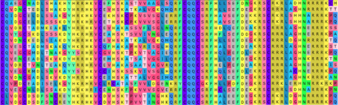
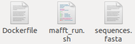

# galileo_docker_mafft

Visit: https://hypernetlabs.io/galileo/tutorials/tutorial-mafft/


## **Running MAFFT over a linux(Ubuntu) base image in Galileo**

This example is going to execute a software called MAFFT ([https://mafft.cbrc.jp/alignment/software/](https://mafft.cbrc.jp/alignment/software/)). This program create a multiple sequence alignments (MSA) ([https://www.bioinformatics.org/wiki/Multiple_sequence_alignment](https://www.bioinformatics.org/wiki/Multiple_sequence_alignment)) of nucleotides or protein sequences (genomes), that is align all the sequences together and see how they differ:





_Multiple sequence alignment of 18 protein sequences. The color represents each amino acid. You can visualize which sequences have the same and different amino acids for each sequence. Clarification: MAFFT cannot visualize the alignment._


## A closer study of the files in our example folder will help illustrate how to modify them and deal with galileo execution. 

I our example folder we have 3 files:





We are going to describe each file deeply in the next section.

**Dockerfile: How to code the Dockerfile**

Let’s quickly review the example Dockerfile, which you can open with a text editor.

The first thing to notice is that the file is called Dockerfile with no extension. It cannot be called anything else—Dockerfile2, Dockerfile copy, or Dockerfile.txt won’t work. Pay attention that the lines with the symbol "#" are comments and will not be executed.

Looking at the Dockerfile with our text editor, the first Docker command we see is:


```
# base image: Ubuntu
FROM ubuntu:16.04
```


This tells Docker  to install Ubuntu, an OS (operative system) based of Linux environment where our programs will run. 

Next, we see some bash commands that will run over our OS already installed in the previous step. The docker command “RUN” execute all of them: 


```
RUN apt-get update --fix-missing \
    && apt-get install -y wget gcc make \
    && cd /usr/local/ \
    && wget -O mafft-7.427-without-extensions-src.tgz https://mafft.cbrc.jp/alignment/software/mafft-7.427-without-extensions-src.tgz \
    && tar -xzvf mafft-7.427-without-extensions-src.tgz \
    && rm -rf mafft-7.427-without-extensions-src.tgz \
    && cd mafft-7.427-without-extensions/core \
    && make \
    && make install \
    && cd /usr/local \
    && rm -rf /usr/local/mafft-7.427-without-extensions/ \
    && apt-get remove -y wget gcc make \
    && apt-get autoremove -y \
    && apt-get clean \
    && rm -rf /var/lib/apt/lists/* \
```


These commands will install mafft program to the Docker container we are creating. This can take a while with packages that are large, but once the package is installed and the Docker container is built, it will run quickly the next time.

To install another program you could add additionals RUN commands to the code below. However, it is necessary to have some knowledge about GNU bash programming language and its commands in order to install other programs. We have to make a distinction between what are docker commands (usually in capital letters), what govern and manage the creation of the container, and what are bash commands.

Now that we understand installing process, let’s look at the next line of code we see in our Docker file:


```
COPY . .
```


This tells Docker where to look for, and where to save our files in the docker environment.

The final command is:


```
ENTRYPOINT ["bash", "mafft_run.sh"]
```


This tells Docker that we are running a bash script file called “mafft_run.sh”.

Here is the Dockerfile from folder in its entirety with comments:


```
# base image: Ubuntu
FROM ubuntu:16.04
 
RUN apt-get update --fix-missing \
    && apt-get install -y wget gcc make \
    && cd /usr/local/ \
    && wget -O mafft-7.427-without-extensions-src.tgz https://mafft.cbrc.jp/alignment/software/mafft-7.427-without-extensions-src.tgz \
    && tar -xzvf mafft-7.427-without-extensions-src.tgz \
    && rm -rf mafft-7.427-without-extensions-src.tgz \
    && cd mafft-7.427-without-extensions/core \
    && make \
    && make install \
    && cd /usr/local \
    && rm -rf /usr/local/mafft-7.427-without-extensions/ \
    && apt-get remove -y wget gcc make \
    && apt-get autoremove -y \
    && apt-get clean \
    && rm -rf /var/lib/apt/lists/* \
 
COPY . .
 
ENTRYPOINT ["bash", "mafft_run.sh"]
```


**Now, Let’s have a look at our bash script file and the data input file**

In our example folder, in addition to the dockerfile we have to have two more files, “newSeqs.fasta” and “mafft_run.sh”. The MAFFT program use as an input a file of genome or protein sequences in a format call “FASTA”, the “newSeqs.fasta”. This file format is commonly used in the area of bioinformatics ([https://www.bioinformatics.nl/tools/crab_fasta.html](https://www.bioinformatics.nl/tools/crab_fasta.html)).

Inside the file “mafft_run.sh”  we have the next command:


```
mafft --thread 30 newSeqs.fasta > msa_out.fasta
```


Here we call the program MAFFT already installed in the docker container, we tell to use the input file “newSeqs.fasta”, tell to store the result of the alignment in the ”msa_out.fasta” file, and defining some optional parameters of the software as “--thread” (the numbers of threads to use). If you want to know more about the options of the MAFFT software you can go to the official web page ([https://mafft.cbrc.jp/alignment/software/](https://mafft.cbrc.jp/alignment/software/)).

**Ready for Launch**

Once you have your folder ready based in the steps above and with the input that you want to run, you could drag and drop the folder onto Galilei on your Dashboard at [https://app.galileoapp.io](https://app.galileoapp.io/).

**Result and outputs**

After you drag and drop the example folder to Galileo, you’ll be able to see the job running in the “Your Recent Jobs” panel. Based on the input file size (number and length of the sequences) the run could take differentes amounts of time. I you want to know how is the complexity of the MAFFT algorithm and how to deal with the computer resources (number of cores and RAM best usage) please read MAFFT documentation ( [https://mafft.cbrc.jp/alignment/software/algorithms/algorithms.html](https://mafft.cbrc.jp/alignment/software/algorithms/algorithms.html)).

When the example job completes, hit the Download button under “Action” to download the results.

The results folder will be downloaded as a .zip that contains an output.log file returning the results of the standard output of the program execution and a folder called filesys where files generated by the program are stored (In our case the “msa_out.fasta” file).

